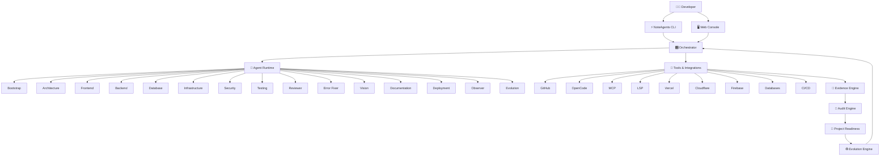
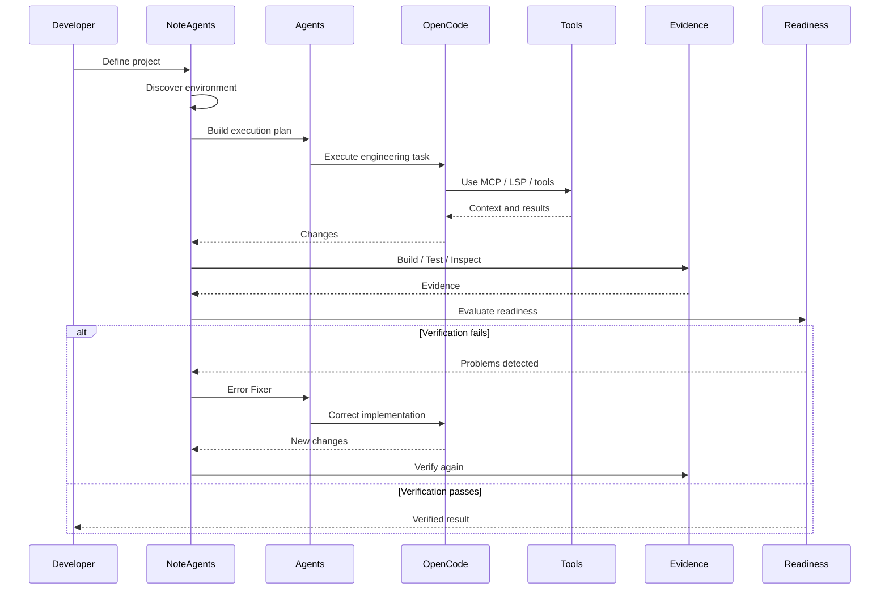

# ⚡ NoteAgents

<p align="center">
  <strong>AI Engineering Control Plane</strong><br/>
  <em>Build faster. Understand everything. Fix automatically. Verify continuously.</em>
</p>

<p align="center">
  
  
  
  
  
  
</p>

<p align="center">
  <a href="#-visão-geral">Visão geral</a> •
  <a href="#-o-problema">Problema</a> •
  <a href="#-como-funciona">Como funciona</a> •
  <a href="#-arquitetura">Arquitetura</a> •
  <a href="#-recursos">Recursos</a> •
  <a href="#-quick-start">Quick Start</a> •
  <a href="#-roadmap">Roadmap</a> •
  <a href="#-contribuindo">Contribuindo</a>
</p>

---

## 🧭 Visão geral

**NoteAgents** é uma plataforma **open source de engenharia de software assistida por IA**, criada para acompanhar um projeto desde a ideia até produção — e continuar acompanhando sua evolução depois do deploy.

Ele não tenta substituir GitHub, Vercel, OpenCode, MCP, LSP, bancos de dados, CI/CD ou outras ferramentas existentes.

O NoteAgents funciona **acima delas**, conectando sinais do ambiente, código, infraestrutura, execução, testes, observabilidade e conhecimento do projeto para transformar esses sinais em:

- 🧠 contexto;
- 🔎 auditoria;
- 🛠️ ações;
- 🧪 validações;
- 📊 insights;
- 📚 conhecimento;
- ✅ evidências;
- 🚦 avaliação de prontidão;
- ♻️ evolução contínua.

> **A IA escreve e executa. O NoteAgents coordena, observa, audita, verifica e ajuda a evoluir.**

---

## 🎯 A tese

A IA tornou possível produzir software muito mais rápido.

O problema é que **produzir código ficou mais rápido do que verificar se o software realmente está correto, seguro, organizado, testado e pronto para usuários reais**.

Um projeto pode compilar e ainda possuir:

- arquitetura inconsistente;
- dependências inadequadas;
- imports quebrados;
- componentes gigantes;
- ausência de testes;
- migrations incompletas;
- banco mal configurado;
- problemas de segurança;
- erros de runtime;
- problemas visuais;
- documentação insuficiente;
- configuração de produção incompleta;
- dívida técnica;
- funcionalidades parcialmente implementadas.

O NoteAgents foi concebido para fechar essa lacuna.

---

# 🚀 O que é o NoteAgents?

```text
                    NOTEAGENTS
                         │
        ┌────────────────┼────────────────┐
        │                │                │
        ▼                ▼                ▼
 Engineering Brain   Knowledge Brain   Control Plane
        │                │                │
        ▼                ▼                ▼
   Código/Runtime    Fontes/Docs       Orquestração
   Banco/Infra       Contexto          Agentes
   OpenCode          Pesquisa          Tools
   MCP/LSP           Chat              Pipelines
   Testes            Evidências        Integrations
        │                │                │
        └────────────────┼────────────────┘
                         ▼
                  PROJECT READINESS
```

O resultado esperado não é:

> “A IA criou meu software.”

É:

> **“Eu construí meu software com IA, e o NoteAgents mostrou o que realmente funciona, encontrou o que estava errado, ajudou a corrigir, verificou as correções e continua acompanhando o projeto.”**

---

# 🧩 O problema que resolvemos

## Antes

```text
IDE
 │
 ├── IA
 ├── Git
 ├── Terminal
 ├── Banco
 ├── Cloud
 ├── CI/CD
 ├── Logs
 └── Documentação

        ↓

"Será que está pronto?"
```

O desenvolvedor precisa juntar manualmente informações de dezenas de ferramentas.

## Com NoteAgents

```text
GitHub ───────┐
Vercel ───────┤
Cloudflare ───┤
Firebase ─────┤
OpenCode ─────┤
MCP ──────────┤
LSP ──────────┤
Database ─────┤
CI/CD ────────┤
Runtime ──────┤
Browser ──────┤
Tests ────────┤
Logs ─────────┤
Workspace ────┘
       │
       ▼
┌──────────────────────┐
│   NOTEAGENTS         │
│                      │
│ Observe              │
│ Understand           │
│ Audit                │
│ Reason               │
│ Act                  │
│ Verify               │
│ Explain              │
└──────────┬───────────┘
           ▼
     PROJECT READINESS
```

---

# 🧠 Dois cérebros

O NoteAgents foi concebido com dois núcleos complementares.

## Engineering Brain

Responsável pelo mundo técnico:

- código;
- arquitetura;
- workspace;
- sistema operacional;
- dependências;
- package managers;
- bancos;
- migrations;
- OpenCode;
- MCP;
- LSP;
- testes;
- builds;
- runtime;
- containers;
- infraestrutura;
- segurança;
- deployment;
- observabilidade.

## Knowledge Brain

Responsável pelo conhecimento:

- documentação;
- fontes;
- arquivos;
- pesquisas;
- decisões;
- contexto;
- chat;
- relatórios;
- explicações;
- conhecimento do projeto;
- citações;
- mapas e sínteses.

```text
             NOTEAGENTS
                 │
       ┌─────────┴─────────┐
       │                   │
       ▼                   ▼
ENGINEERING BRAIN     KNOWLEDGE BRAIN
       │                   │
       ├─ Code             ├─ Sources
       ├─ Runtime          ├─ Documents
       ├─ Database         ├─ Research
       ├─ Infra            ├─ Context
       ├─ Tests            ├─ Chat
       ├─ Security         └─ Evidence
       └─ Production
                 │
                 ▼
          UNIFIED CONTEXT
```

---

# 🏗️ Arquitetura

A arquitetura é orientada a **agentes especializados, contratos, evidências e validação real**.



---

# 🔄 Pipeline de engenharia

O NoteAgents trata desenvolvimento como um processo verificável.

```text
IDEA
  ↓
PROJECT
  ↓
ENVIRONMENT
  ↓
ARCHITECTURE
  ↓
DATABASE
  ↓
IMPLEMENTATION
  ↓
TESTING
  ↓
AUDIT
  ↓
ERROR DETECTION
  ↓
AUTO FIX
  ↓
VERIFICATION
  ↓
DEPLOYMENT
  ↓
PRODUCTION
  ↓
MARKET READINESS
  ↓
CONTINUOUS EVOLUTION
```

O princípio é simples:

> **Nenhum agente deve ser considerado correto apenas porque afirmou que terminou.**

---

# 🔐 Evidence Engine

O coração da filosofia do NoteAgents é a **evidência**.

Se um agente disser:

> “Autenticação implementada.”

isso não basta.

O sistema deve procurar evidências:

```text
Agent Claim
    │
    ▼
File Verification
    │
    ▼
Dependency Verification
    │
    ▼
Build
    │
    ▼
Lint
    │
    ▼
Tests
    │
    ▼
Runtime
    │
    ▼
Health Check
    │
    ▼
Security Checks
    │
    ▼
Evidence
    │
    ▼
VERIFIED / FAILED
```

Exemplo:

```text
AUTHENTICATION
────────────────────────────
✓ Routes exist
✓ Middleware exists
✓ Database migration exists
✓ Types compile
✓ Unit tests pass
✓ Integration tests pass
✓ API responds
✓ Error handling verified
✓ Security checks passed

STATUS: VERIFIED
```

---

# 🔎 Auditoria contínua

O Auditor analisa o projeto de forma multidimensional.

### Código

- imports;
- exports;
- duplicação;
- complexidade;
- arquivos gigantes;
- dead code;
- padrões inconsistentes.

### Arquitetura

- separação de responsabilidades;
- dependências;
- boundaries;
- organização de módulos;
- acoplamento;
- coerência estrutural.

### Frontend

- componentes;
- rotas;
- acessibilidade;
- responsividade;
- estados;
- UX;
- consistência visual;
- visual regression.

### Backend

- APIs;
- contratos;
- autenticação;
- autorização;
- tratamento de erros;
- validações;
- observabilidade.

### Banco

- schema;
- migrations;
- índices;
- constraints;
- relações;
- dados inconsistentes;
- estratégia de backup.

### Infraestrutura

- containers;
- variáveis;
- deployment;
- health checks;
- serviços;
- configuração de ambiente.

### Segurança

- secrets;
- permissões;
- dependências;
- exposição de endpoints;
- configurações perigosas;
- práticas inseguras.

---

# 👁️ Vision Engine

Um dos diferenciais do NoteAgents é transformar uma referência visual em contexto de engenharia.

```text
Screenshot / Image
        │
        ▼
   Vision Engine
        │
        ├── OCR
        ├── Layout Detection
        ├── Component Detection
        ├── Spacing
        ├── Typography
        ├── Colors
        ├── Design Tokens
        └── Visual Structure
        │
        ▼
Visual Contract
        │
        ▼
Engineering Specification
        │
        ▼
OpenCode / Agents
        │
        ▼
Implementation
        │
        ▼
Browser Screenshot
        │
        ▼
Visual Comparison
```

A visão não termina em:

> “A imagem parece um dashboard.”

Ela deve produzir informações acionáveis:

```text
Header
 ├── Logo
 ├── Navigation
 └── User Menu

Sidebar
 ├── Dashboard
 ├── Projects
 ├── Agents
 ├── Audit
 └── Settings

Main
 ├── KPI Cards
 ├── Pipeline
 ├── Activity
 └── Insights
```

---

# 🤖 Agent Runtime

Os agentes são especializados e desacoplados.

```text
agents/
├── bootstrap/
├── product/
├── architecture/
├── frontend/
├── backend/
├── database/
├── infrastructure/
├── security/
├── testing/
├── reviewer/
├── error-fixer/
├── vision/
├── documentation/
├── deployment/
├── observer/
└── evolution/
```

Cada agente deve possuir contrato explícito.

```text
agent/
├── agent.md
├── system.md
├── contract.json
├── state.json
├── tools/
└── tests/
```

O objetivo é permitir evolução independente e futura distribuição como plugins.

---

# 🔌 OpenCode + MCP + LSP

O NoteAgents não compete com o OpenCode.

Ele trabalha **em paralelo e acima dele**.

```text
                 NOTEAGENTS
                     │
             ┌───────┴───────┐
             │               │
             ▼               ▼
       Orchestrator      Knowledge
             │
             ▼
          OpenCode
             │
       ┌─────┴─────┐
       ▼           ▼
      MCP         LSP
       │           │
       ▼           ▼
    Tools      Language Context
       │           │
       └─────┬─────┘
             ▼
        REAL WORKSPACE
```

### MCP

Fornece ferramentas e contexto operacional.

### LSP

Fornece contexto semântico de linguagem:

- símbolos;
- referências;
- diagnósticos;
- definição;
- navegação;
- tipos.

### OpenCode

Executa o trabalho de engenharia.

### NoteAgents

Coordena, observa, audita e verifica.

---

# 🧰 Integrações

O NoteAgents foi pensado como uma camada de integração.

```text
                    NOTEAGENTS
                         │
 ┌──────────┬────────────┼────────────┬──────────┐
 ▼          ▼            ▼            ▼          ▼
GitHub    OpenCode      MCP          LSP      Databases
 │          │            │            │          │
 ▼          ▼            ▼            ▼          ▼
Commits    Agents       Tools      Language   Schema
PRs        Runtime      Servers    Context    Migrations
Issues     Models       Resources  Diagnostics Queries
Actions
```

Integrações previstas/arquitetadas:

- GitHub;
- Slack;
- Vercel;
- Cloudflare;
- Firebase;
- OpenCode;
- MCP;
- LSP;
- bancos de dados;
- CI/CD;
- providers de IA;
- ferramentas de observabilidade.

---

# 📚 Knowledge Studio

O projeto pode manter uma camada de fontes e conhecimento.

```text
Sources
  │
  ├── Documents
  ├── PDFs
  ├── URLs
  ├── Code
  ├── Notes
  ├── Specifications
  ├── Decisions
  └── Research
        │
        ▼
 Knowledge Ingestion
        │
        ▼
 Project Context
        │
        ▼
 Engineering Chat
        │
        ▼
 Agents / Audit / Reports
```

O objetivo é evitar que a IA trate o projeto como uma conversa sem memória estrutural.

---

# 💬 Engineering Chat

O chat é uma interface para trabalhar sobre o projeto.

Exemplos:

```text
"Analise o projeto inteiro."

"O que está impedindo produção?"

"Quais erros foram encontrados?"

"Por que essa migration está falhando?"

"Analise esta tela."

"Compare esta imagem com o frontend."

"Quais componentes deveriam ser extraídos?"

"Quais dependências estão faltando?"

"Esse banco está preparado para produção?"

"Faça uma auditoria de segurança."

"Quais são os próximos passos?"
```

As respostas devem estar vinculadas ao contexto e, quando aplicável, às evidências produzidas pelo sistema.

---

# 🚦 Project Readiness

O objetivo não é simplesmente mostrar uma porcentagem bonita.

O Readiness Engine deve explicar **por que** o projeto está ou não pronto.

```text
PROJECT READINESS
──────────────────────────────

Architecture       █████████░  90%
Frontend           ████████░░  80%
Backend            ████████░░  82%
Database           █████████░  91%
Tests              ██████░░░░  61%
Security           ███████░░░  73%
Infrastructure     ████████░░  84%
Documentation      █████░░░░░  52%
Observability      ██████░░░░  64%

Overall: 76%

BLOCKERS
🔴 3 critical
🟠 7 high
🟡 14 medium

MARKET READINESS: NOT READY
```

A métrica deve ser explicável e baseada em sinais verificáveis.

---

# ♻️ Evolution Engine

Quando o sistema encontra um problema:

```text
Problem
   ↓
Classification
   ↓
Root Cause
   ↓
Suggested Fix
   ↓
Approval / Policy
   ↓
Agent Execution
   ↓
Build
   ↓
Tests
   ↓
Verification
   ↓
Evidence
   ↓
Resolved
```

Se falhar:

```text
FAIL
 ↓
Collect Evidence
 ↓
Re-plan
 ↓
Retry
 ↓
Verify
```

O objetivo é transformar falhas em evolução contínua, sem permitir automação destrutiva sem controle.

---

# 🖥️ CLI

O NoteAgents possui uma visão CLI-first.

Exemplos conceituais:

```bash
noteagents init
noteagents configure
noteagents doctor

noteagents agents
noteagents agents list
noteagents agents run frontend

noteagents audit
noteagents audit security
noteagents audit architecture

noteagents test
noteagents build

noteagents status
noteagents evidence
noteagents readiness

noteagents fix
noteagents production-check

noteagents sources
noteagents chat
noteagents pipeline
```

A CLI deve ser útil mesmo sem o Web Console.

---

# 🖥️ Web Console

A interface web transforma a plataforma em um centro de controle visual.

Principais áreas:

```text
Dashboard
Projects
Pipeline
Agents
Audit
Evidence
Readiness
Sources
Knowledge
Chat
Vision
Integrations
Environment
Database
Security
Tests
Deployments
Logs
Settings
```

Princípio:

> **Nenhuma tela deve ser apenas decorativa.**

Cada funcionalidade deve possuir:

```text
UI
 ↓
State
 ↓
Action
 ↓
Backend Contract
 ↓
Validation
 ↓
Error Handling
 ↓
Evidence
 ↓
Tests
```

---

# 🗂️ Estrutura do projeto

Estrutura arquitetural proposta:

```text
NoteAgents/
│
├── apps/
│   ├── cli/
│   ├── web/
│   └── integrations/
│
├── packages/
│   ├── core/
│   ├── agents/
│   ├── orchestration/
│   ├── integrations/
│   ├── providers/
│   ├── contracts/
│   ├── vision/
│   ├── knowledge/
│   ├── audit/
│   ├── evidence/
│   ├── readiness/
│   └── evolution/
│
├── agents/
│   ├── bootstrap/
│   ├── architecture/
│   ├── frontend/
│   ├── backend/
│   ├── database/
│   ├── infrastructure/
│   ├── security/
│   ├── testing/
│   ├── reviewer/
│   ├── error-fixer/
│   ├── vision/
│   ├── documentation/
│   ├── deployment/
│   ├── observer/
│   └── evolution/
│
├── integrations/
│   ├── opencode/
│   ├── mcp/
│   ├── lsp/
│   ├── github/
│   ├── slack/
│   ├── vercel/
│   ├── cloudflare/
│   └── firebase/
│
├── docs/
│   ├── architecture/
│   ├── agents/
│   ├── cli/
│   ├── integrations/
│   ├── knowledge/
│   ├── vision/
│   ├── audit/
│   ├── evidence/
│   ├── readiness/
│   ├── security/
│   └── governance/
│
├── infrastructure/
├── scripts/
├── tests/
│
├── AGENTS.md
├── ARCHITECTURE.md
├── CONTRIBUTING.md
├── GOVERNANCE.md
├── SECURITY.md
├── CODE_OF_CONDUCT.md
├── CHANGELOG.md
├── LICENSE
└── README.md
```

> A estrutura acima representa a arquitetura-alvo do projeto. Diretórios ainda não implementados devem ser tratados como roadmap, não como funcionalidades já disponíveis.

---

# 🛡️ Segurança e controle

O NoteAgents opera sobre recursos potencialmente sensíveis.

Por isso, a arquitetura prioriza:

- permissões explícitas;
- operações destrutivas com aprovação;
- isolamento de ferramentas;
- secrets fora do código;
- auditoria de ações;
- evidências;
- logs;
- políticas por agente;
- controle de escopo;
- separação entre leitura e escrita;
- proteção contra execução acidental.

### Princípio

```text
READ
  ↓
ANALYZE
  ↓
PROPOSE
  ↓
APPROVE
  ↓
WRITE
  ↓
VERIFY
```

Automação não deve significar ausência de controle.

---

# 🧪 Qualidade

O NoteAgents deve validar o próprio trabalho.

Camadas:

```text
Unit Tests
     ↓
Integration Tests
     ↓
Contract Tests
     ↓
Build
     ↓
Lint
     ↓
Type Check
     ↓
Runtime Tests
     ↓
Health Checks
     ↓
Security Checks
     ↓
Browser / Visual Tests
     ↓
Evidence
```

A qualidade é parte do pipeline, não uma etapa opcional no final.

---

# 📊 Observability

O Observer acompanha:

- processos;
- builds;
- testes;
- runtime;
- logs;
- deployments;
- health;
- erros;
- falhas de integração;
- mudanças relevantes;
- estado do projeto.

Fluxo:

```text
Workspace / Runtime
        │
        ▼
     Observer
        │
        ▼
      Signals
        │
        ▼
   Evidence Engine
        │
        ▼
      Auditor
        │
        ▼
 Readiness / Insights
```

---

# 🔁 Ciclo completo



---

# 🧱 Princípios arquiteturais

O projeto deve preservar:

### Modularity

Componentes independentes e substituíveis.

### Explicit Contracts

Agentes, providers, tools e integrações devem possuir contratos claros.

### Evidence First

Afirmações da IA devem ser verificáveis.

### Provider Agnostic

O runtime não deve depender de um único fornecedor de IA.

### Tool Agnostic

Ferramentas externas devem entrar por adapters.

### Human Control

A autonomia deve respeitar políticas e permissões.

### Production First

Toda funcionalidade deve considerar:

- segurança;
- observabilidade;
- testes;
- documentação;
- manutenção;
- escalabilidade.

### Dependency Driven

A implementação deve seguir dependências técnicas, não apenas telas.

---

# 🛣️ Roadmap

## Phase 1 — Foundation

- [ ] CLI
- [ ] Workspace Manager
- [ ] Environment Discovery
- [ ] Permission System
- [ ] Project Management
- [ ] Provider Abstraction
- [ ] Agent Runtime
- [ ] Basic Web Console

## Phase 2 — Engineering Core

- [ ] OpenCode integration
- [ ] MCP
- [ ] LSP
- [ ] Package Manager Intelligence
- [ ] Database Intelligence
- [ ] Migrations
- [ ] Build
- [ ] Test
- [ ] Audit
- [ ] Evidence

## Phase 3 — Knowledge

- [ ] Sources
- [ ] Knowledge Studio
- [ ] Engineering Chat
- [ ] Document ingestion
- [ ] Semantic search
- [ ] Citations
- [ ] Project context

## Phase 4 — Vision

- [ ] Screenshot analysis
- [ ] OCR
- [ ] Component detection
- [ ] Design token extraction
- [ ] Visual contracts
- [ ] Browser comparison
- [ ] Visual regression

## Phase 5 — Autonomous Engineering

- [ ] Auto-fix
- [ ] Retries
- [ ] Agent orchestration
- [ ] Continuous Observer
- [ ] Autonomous pipelines
- [ ] Technical debt
- [ ] Insights
- [ ] Readiness

## Phase 6 — Integrations

- [ ] GitHub
- [ ] Slack
- [ ] Vercel
- [ ] Cloudflare
- [ ] Firebase
- [ ] CI/CD
- [ ] Additional providers
- [ ] Agent Registry
- [ ] Plugin ecosystem

---

# 🧩 Plugin ecosystem

O objetivo de longo prazo é permitir que a comunidade adicione:

```text
Agents
Providers
MCP Servers
LSP Adapters
Validators
Integrations
Pipelines
Auditors
Knowledge Sources
Vision Modules
```

Exemplo conceitual:

```bash
noteagents plugin install nextjs
noteagents plugin install laravel
noteagents plugin install postgres
noteagents plugin install kubernetes
noteagents plugin install security
```

A arquitetura deve permitir um futuro **NoteAgents Registry**.

---

# ⚙️ Quick Start

> ⚠️ O projeto está em desenvolvimento ativo. Os comandos abaixo representam a interface proposta e devem ser validados conforme cada módulo for implementado.

### Clone

```bash
git clone https://github.com/deevo-solucoes-finaceiras/NoteAgents.git
cd NoteAgents
```

### Instalação

```bash
pnpm install
```

### Configuração

```bash
cp .env.example .env
```

Configure os providers e integrações necessários.

### Inicialização

```bash
noteagents init
```

### Diagnóstico

```bash
noteagents doctor
```

### Status

```bash
noteagents status
```

### Auditoria

```bash
noteagents audit
```

### Readiness

```bash
noteagents readiness
```

---

# 🤝 Trabalhando com OpenCode

O NoteAgents foi desenhado para trabalhar **junto** com o OpenCode.

```text
Developer
    │
    ├───────────────► OpenCode
    │                    │
    │                    ├── MCP
    │                    ├── LSP
    │                    └── Tools
    │
    └───────────────► NoteAgents
                         │
                         ├── Audit
                         ├── Evidence
                         ├── Observer
                         ├── Readiness
                         └── Evolution
```

A proposta não é bloquear o desenvolvedor.

É permitir que ele trabalhe com o OpenCode normalmente enquanto o NoteAgents fornece uma camada adicional de engenharia e verificação.

---

# 🌐 Integrações de infraestrutura

O produto foi pensado para coexistir com ferramentas já utilizadas por equipes modernas:

| Categoria | Integrações |
|---|---|
| Source Control | Git / GitHub |
| AI Coding | OpenCode |
| Tool Protocol | MCP |
| Language Intelligence | LSP |
| Deployment | Vercel / Cloudflare |
| Backend Services | Firebase |
| Database | PostgreSQL e outros |
| CI/CD | Pipelines externos |
| Communication | Slack |
| AI Providers | Providers compatíveis |
| Runtime | Local / Containers / Cloud |

---

# 🏁 Filosofia do produto

O NoteAgents não quer dizer:

> “Confie na IA.”

Ele quer dizer:

> **“Use IA em escala, mas verifique o resultado.”**

A plataforma deve transformar:

```text
AI Generation
      ↓
Engineering Process
      ↓
Validation
      ↓
Evidence
      ↓
Confidence
```

---

# 🌟 Diferencial

Existem ferramentas excelentes para escrever código.

Existem ferramentas excelentes para Git.

Existem ferramentas excelentes para deploy.

Existem ferramentas excelentes para observabilidade.

Existem ferramentas excelentes para documentação.

O NoteAgents pretende conectar esses mundos.

```text
                ┌──────────────┐
                │   Developer  │
                └──────┬───────┘
                       │
                       ▼
                ┌──────────────┐
                │  NoteAgents  │
                │              │
                │ Orchestrate  │
                │ Understand   │
                │ Audit        │
                │ Verify       │
                │ Evolve       │
                └──────┬───────┘
                       │
      ┌────────────────┼────────────────┐
      ▼                ▼                ▼
   AI Agents         Tools           Evidence
      │                │                │
      ▼                ▼                ▼
   OpenCode      MCP / LSP / Git    Tests / Logs
      │                │                │
      └────────────────┼────────────────┘
                       ▼
                 REAL SOFTWARE
                       │
                       ▼
                MARKET READINESS
```

---

# 🏆 A visão

> **NoteAgents — Your AI Engineering Control Plane.**

Um companheiro permanente de engenharia que acompanha o projeto:

```text
IDEA
 ↓
DESIGN
 ↓
BUILD
 ↓
TEST
 ↓
AUDIT
 ↓
FIX
 ↓
VERIFY
 ↓
DEPLOY
 ↓
PRODUCTION
 ↓
MONITOR
 ↓
EVOLVE
```

Não é apenas uma ferramenta para criar software.

É uma tentativa de construir uma **camada aberta de coordenação para a nova era de engenharia de software assistida por agentes**.

---

# 📜 Status

**Development stage:** Active development 🚧

A arquitetura e o roadmap estão em evolução. Recursos marcados como roadmap ou conceptuais não devem ser interpretados como implementados.

---

# 🤝 Contribuindo

Contribuições são bem-vindas.

Antes de abrir um Pull Request:

```bash
git checkout -b feat/my-feature
```

Faça as alterações, testes e validações necessárias.

Depois:

```bash
git add .
git commit -m "feat: describe the change"
git push origin feat/my-feature
```

Abra um Pull Request descrevendo:

- problema;
- solução;
- impacto arquitetural;
- testes;
- evidências;
- riscos;
- documentação atualizada.

Consulte:

- `CONTRIBUTING.md`
- `CODE_OF_CONDUCT.md`
- `GOVERNANCE.md`
- `SECURITY.md`

---

# 🔒 Segurança

Nunca publique:

```text
.env
.env.local
API keys
OAuth secrets
private keys
tokens
service-account credentials
```

Use `.env.example` para documentar configurações necessárias sem expor segredos.

Vulnerabilidades devem seguir o processo descrito em `SECURITY.md`.

---

# 📄 Licença

A licença definitiva deve ser definida pelo projeto antes do primeiro release público.

---

# 💙 NoteAgents

<p align="center">
  <strong>Build faster.</strong><br/>
  <strong>Understand everything.</strong><br/>
  <strong>Fix automatically.</strong><br/>
  <strong>Verify continuously.</strong>
</p>

<p align="center">
  Made for developers building the next generation of software with AI.
</p>
